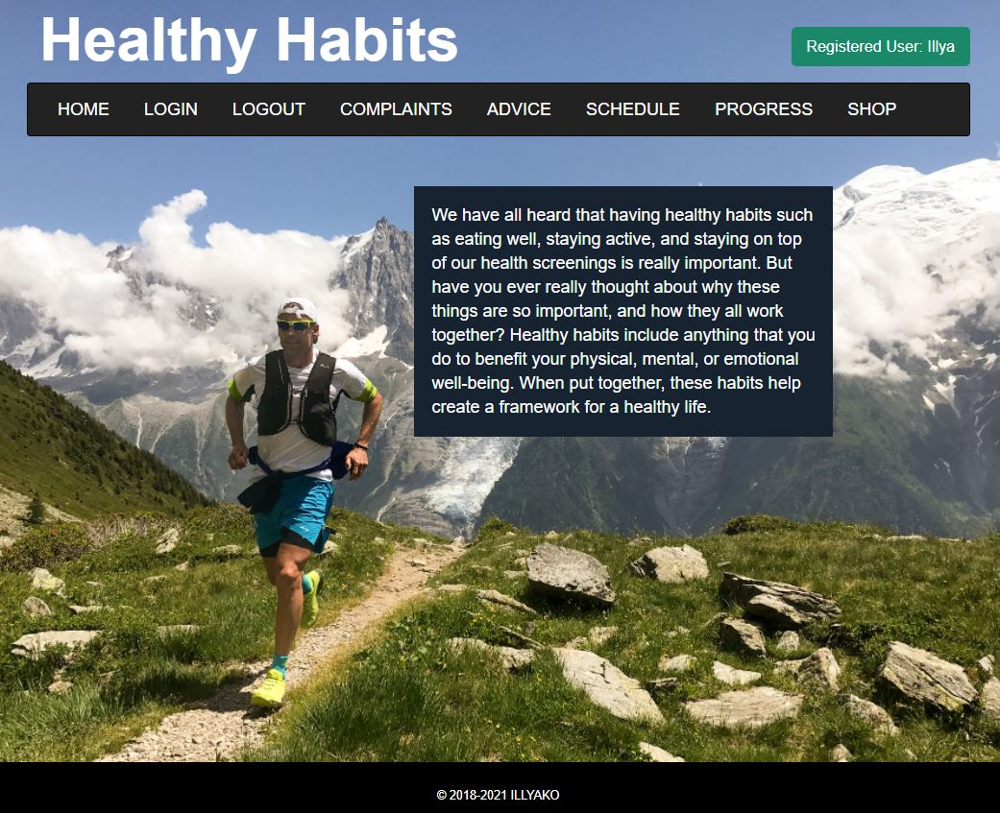
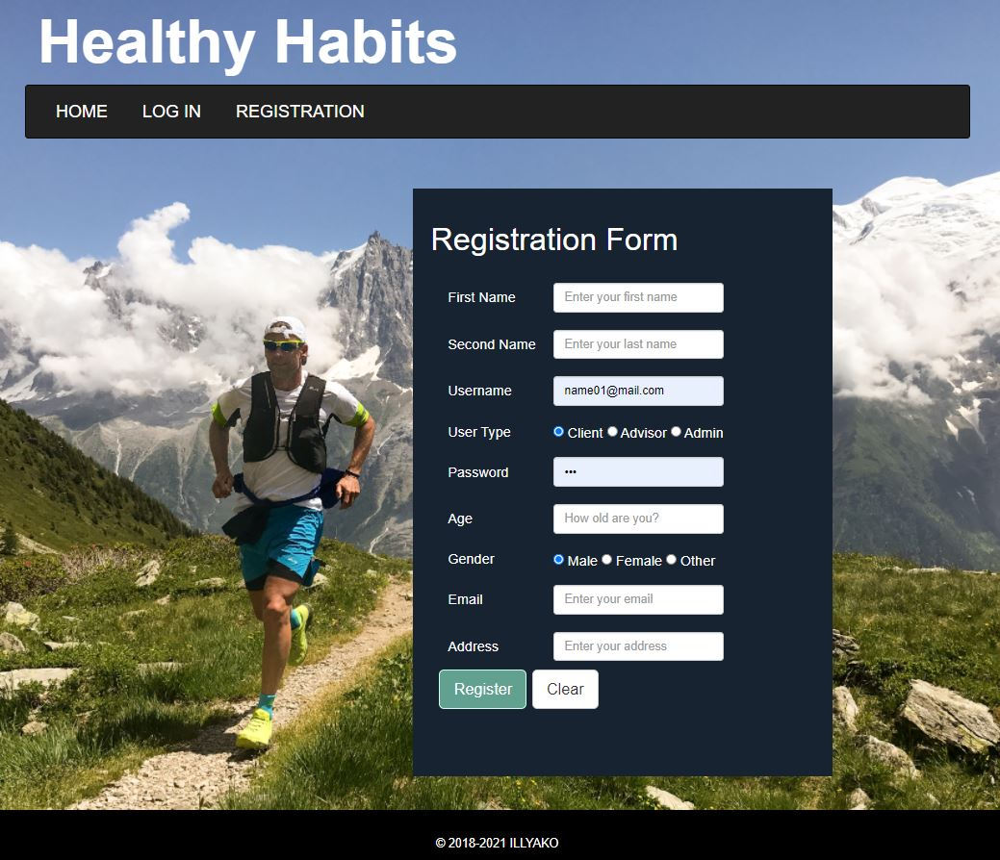
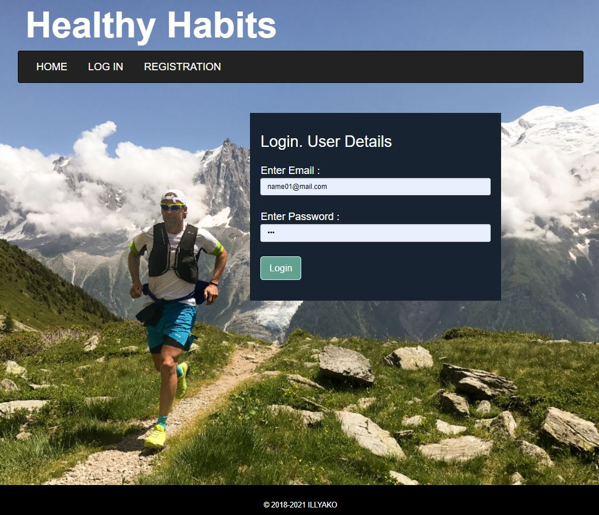
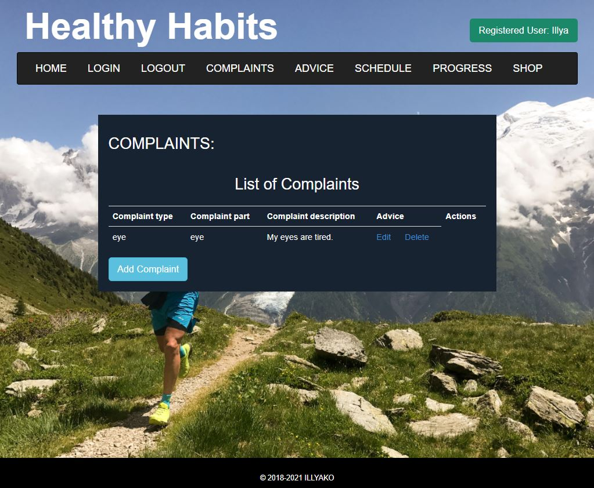
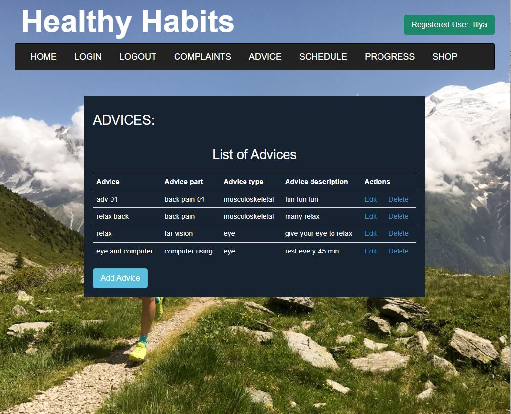
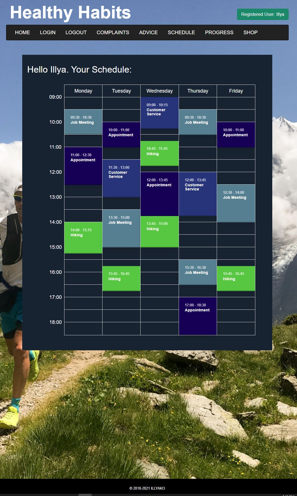
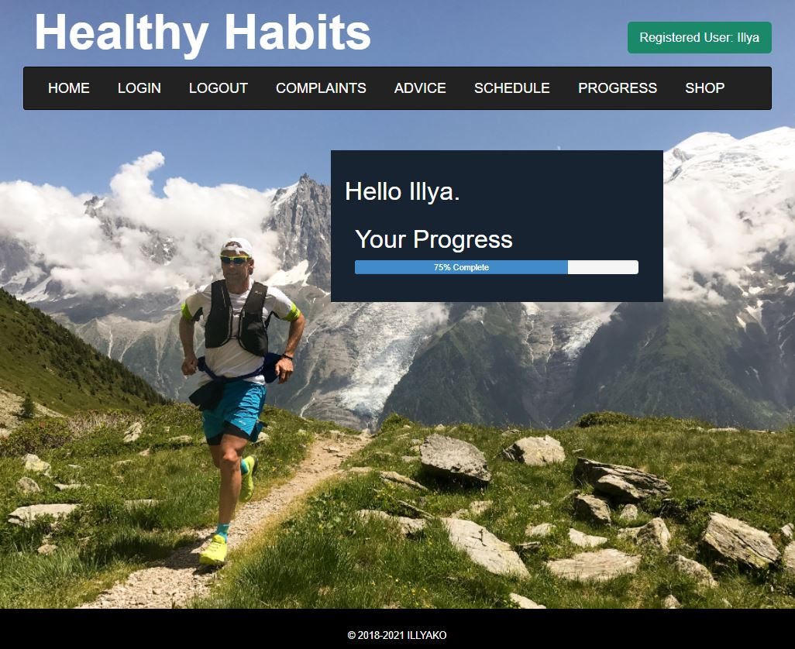

# **Healthy Habits**

Main idea of project is to help people create healthy habits.

The multi-pages project has a front end with welcome page, registration form, sign in, request form,
answer list page and etc. There are Model-View-Controller Patter on the Java back end and connection to the MySQL database.

## Home page

## Registration page

## Login page

## Complaints page

## Advice page

## Schedule page

## Progress page

